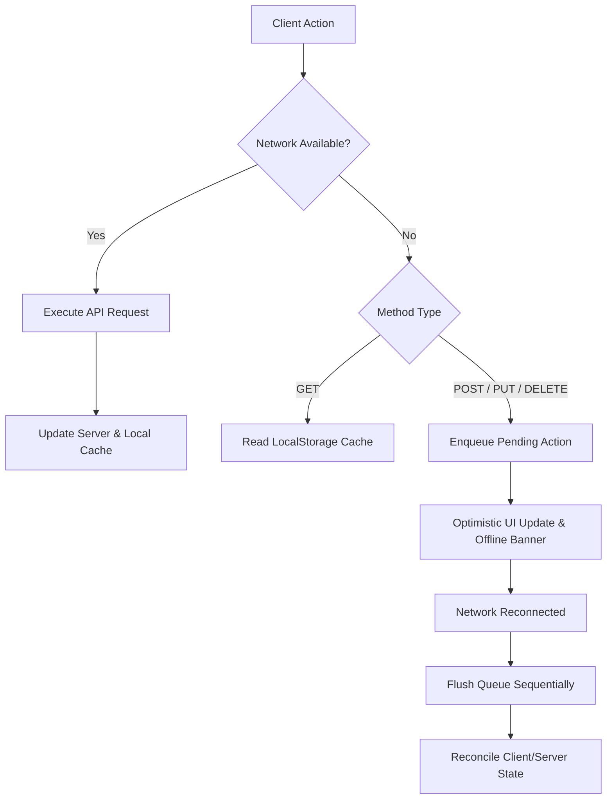

# Mirov

Mirov is a web-based workspace and data management application featuring an offline-first architecture, role-based access control (RBAC), custom database tables, team notes, and activity audit logging.

## Core Features

- **Authentication & RBAC**: Multi-role support (`SUPERUSER`, `ADMIN`, `UMUM`) using JWT and bcrypt password hashing.
- **Dynamic Grid Engine**: Customizable data tables supporting custom field schemas, sorting, filtering, and Excel export via ExcelJS.
- **Team Notes**: Collaborative workspace notes with tagging, search, pinning, and access permission checks.
- **Audit Logging & History**: Activity tracking for create, update, and delete actions across notes, databases, and schedules with role-tagged logs.
- **Analytics Visualizations**: Activity heatmaps and interactive charts powered by Recharts.
- **Offline-First Synchronization Engine**: Client-side query caching and queued mutation background sync.

## Offline-First Architecture

The offline engine (`src/services/offlineSync.ts`) ensures uninterrupted workflow when network connection is degraded or unavailable:



### Synchronization Logic
1. **Read Operations (GET)**: Serves cached data from `localStorage` if network requests fail.
2. **Write Operations (POST/PUT/PATCH/DELETE)**: Queues pending actions locally when offline.
3. **Payload Consolidation**: Merges subsequent updates into pending creation payloads to reduce redundant network requests upon sync.
4. **ID Reconciliation**: Maps client-generated temporary IDs (`act_*`) to server-assigned database IDs during queue execution.

## System Architecture & Tech Stack

### Frontend
- **Framework**: React 18, TypeScript, Vite
- **Styling**: Tailwind CSS, PostCSS, Lucide Icons, Framer Motion
- **Data & UI**: Recharts, ExcelJS, Radix UI

### Backend
- **Runtime**: Node.js, Express 5
- **Database & ORM**: MySQL, Drizzle ORM
- **Auth**: JWT, Bcrypt

## Project Structure

```
Mirov/
├── public/                 # Static web assets
├── server/                 # Express backend service
│   └── src/
│       ├── config/         # App & DB configuration
│       ├── controllers/    # API controllers
│       ├── db/             # Drizzle ORM schema & migrations
│       ├── middleware/     # Auth & RBAC middlewares
│       └── routes/         # Express routing definitions
├── src/                    # React frontend application
│   ├── components/         # UI components & views
│   ├── context/            # React context providers
│   ├── hooks/              # Custom React hooks
│   ├── services/           # Sync engine & API clients
│   └── types/              # TypeScript definitions
└── README.md
```

## Getting Started

### Prerequisites
- Node.js (v18 or higher)
- MySQL instance

### Installation

1. Clone repository and install dependencies:
   ```bash
   git clone https://github.com/rzikydn/Mirov.git
   cd Mirov

   # Frontend dependencies
   npm install

   # Backend dependencies
   cd server
   npm install
   cd ..
   ```

2. Environment configuration:

   Create `.env` in project root:
   ```env
   VITE_API_URL=http://localhost:5000/api
   ```

   Create `server/.env`:
   ```env
   PORT=5000
   DATABASE_URL=mysql://root:@localhost:3306/mirov_db
   JWT_SECRET=your_jwt_secret_key
   ```

3. Database migration:
   ```bash
   cd server
   npx drizzle-kit push
   cd ..
   ```

4. Run development servers:

   ```bash
   # Terminal 1: Backend
   cd server
   npm run dev

   # Terminal 2: Frontend
   npm run dev
   ```

## API Reference

| Method | Endpoint | Description | Auth |
|---|---|---|---|
| POST | `/api/auth/register` | User registration | No |
| POST | `/api/auth/login` | User login & JWT issuance | No |
| GET | `/api/databases` | List user database tables | Yes |
| POST | `/api/databases` | Create database table | Yes |
| PUT | `/api/databases/:id` | Update database table | Yes |
| DELETE | `/api/databases/:id` | Delete database table | Yes |
| GET | `/api/notes` | List workspace notes | Yes |
| POST | `/api/notes` | Create note | Yes |
| GET | `/api/history` | Retrieve activity history logs | Yes |
| GET | `/api/schedule` | Retrieve schedules | Yes |

## License

ISC License.
